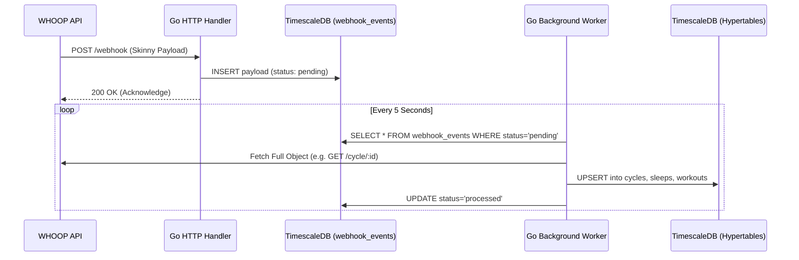

# WHOOP Stats

A premium, high-performance, open-source dashboard and ingestion engine for your WHOOP fitness data.


## Features

*   **Dual-Mode Ingestion (Webhook & Poller):** Run the backend in Webhook mode (the "Inbox Pattern") for real-time updates, or in Poller mode to aggressively scrape the API on a configurable schedule.
*   **Continuous Aggregates:** Postgres/TimescaleDB materialized views natively pre-compute 30-day strain and recovery trends for `O(1)` read performance.
*   **Linear-Inspired Dashboard:** A hyper-snappy Next.js 16 (App Router) interface using Tailwind CSS v4, Framer Motion, and Glassmorphism.
*   **Interactive Visualizations:** Deep dive into sleep stages, HR zones, and custom Recharts with macOS-style tooltips. Features a dedicated UI **"Sync" Button** to trigger ad-hoc backend synchronization and immediately refresh the dashboard.
*   **Fully Typed:** 100% end-to-end type safety from the Postgres schema to the Next.js UI using `sqlc` and `openapi-typescript`.

---

## Architecture: Dual Ingestion Engines

This project supports two primary modes of operation (`-mode webhook` or `-mode poll`).

### 1. The Webhook Inbox Pattern (Recommended)
We prioritize data integrity. WHOOP webhooks require immediate HTTP `200 OK` responses, otherwise, they drop the payload. If the WHOOP API is rate-limiting us while we try to fetch the full object, traditional synchronous processing fails.

This project uses an **Inbox Pattern**:
1. The Webhook Handler validates the HMAC signature and dumps the raw JSON into the `webhook_events` table (`status: pending`).
2. It returns a `200 OK` within milliseconds.
3. A background Go worker plucks pending events, fetches the full data via the `whoop-go` SDK using exponential backoff, and safely UPSERTs the TimescaleDB hypertables.

### 2. The Polling Engine (Ideal for Homelabs)
If you are hosting this on a local network (like a homelab or NAS) and do not want to expose your server to the public internet to receive webhooks, you should run the application in `poll` mode. 

In this mode, the backend spins up concurrent background workers that aggressively and safely scrape the WHOOP API on configurable intervals. Since it only makes outbound requests, it easily bypasses NATs and firewalls without requiring reverse proxies (like ngrok or Cloudflare Tunnels).

```bash
# Environment Configuration for Poller
export POLL_INTERVAL_CYCLE="4h"
export POLL_INTERVAL_WORKOUT="30m"
export POLL_INTERVAL_SLEEP="1h"
```



---

## Getting Started

### 1. Prerequisites
* Docker and Docker Compose
* Node.js v18+ (for local frontend development)
* Go 1.22+ (for local backend development)
* A WHOOP Developer account

### 2. Environment Setup
Copy the example environment file:
```bash
cp .env.example .env
```
Fill in your `WHOOP_CLIENT_ID`, `WHOOP_CLIENT_SECRET`, and a random 32-character string for your `ENCRYPTION_KEY`.

### 3. Production Deployment
This repository is configured with multi-stage Dockerfiles optimized for production.

```bash
docker-compose -f docker-compose.prod.yml up -d --build
```
This single command spins up:
1.  **TimescaleDB (Postgres 15)**
2.  **Go API & Worker (Port 8080)**
3.  **Next.js Frontend (Port 3000)**

Access your dashboard at `http://localhost:3000`.

#### Customizing Ports
If you already have services running on ports `8080` or `3000` on your home server, you can easily alter the external bindings in `docker-compose.prod.yml` without changing any code:
*   To change the **Backend API** port from `8080`, modify the ports block under `backend`: `-"9090:8080"`
*   To change the **Frontend UI** port from `3000`, modify the ports block under `frontend`: `-"4000:3000"`

### 4. Local Development
**Database:**
```bash
docker-compose up -d timescaledb
```

**Backend:**
```bash
go run cmd/server/main.go -mode webhook
```

**Frontend:**
```bash
cd web
npm install --legacy-peer-deps
npm run dev
```

## Security

* **AES-256-GCM:** Your WHOOP OAuth Access and Refresh tokens are encrypted natively in the Postgres database.
* **Advisory Locks:** Ad-hoc manual sync triggers use thread-safe mutexes to prevent concurrent DB race conditions.
* **Non-Root Containers:** All Dockerfile instructions strictly drop privileges to `appuser`/`nextjs` before executing.
