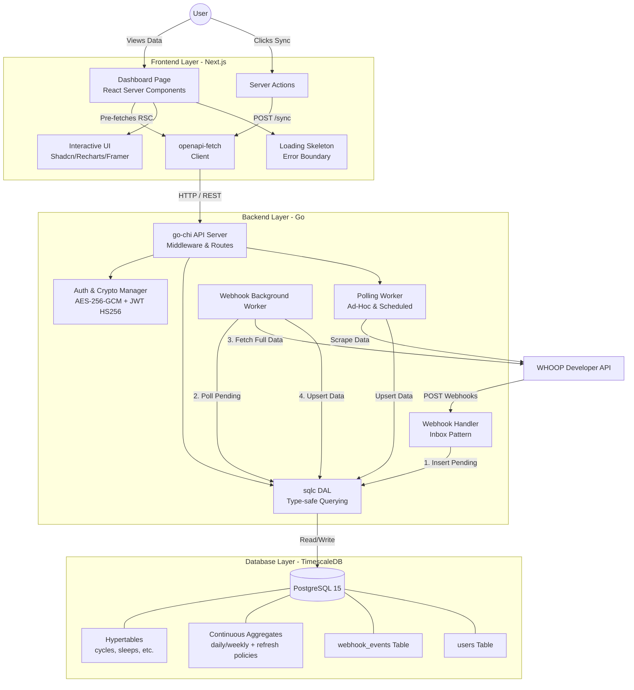

# WHOOP Stats Architecture & Design Document

This document outlines the architectural decisions, component breakdown, and technical justifications for the WHOOP Stats application. The system is designed to be a high-performance, self-hostable, and zero-data-loss platform for ingesting, storing, and visualizing WHOOP fitness data.

The architecture is split into three core layers: **Database (TimescaleDB)**, **Backend (Go)**, and **Frontend (Next.js)**.

---

## 1. Database Layer: Postgres & TimescaleDB

### Components
*   **PostgreSQL 15:** The foundational relational database.
*   **TimescaleDB Extension:** Transforms standard Postgres into a high-performance time-series database.
*   **Hypertables:** Data tables partitioned automatically across time intervals (`cycles`, `sleeps`, `workouts`, `recoveries`).
*   **Continuous Aggregates:** Materialized views (`daily_strain`, `weekly_strain`, `daily_recovery`, `weekly_recovery`, `daily_sleep`) that incrementally pre-calculate data. Auto-refreshed hourly with a 3-day lookback window.

### Design Decisions & Justifications
*   **Why TimescaleDB?** WHOOP data is inherently time-series (continuous streams of biometric data spanning months or years). Traditional RDBMS struggle with massive time-series scaling. TimescaleDB provides the strict ACID guarantees and relational constraints of Postgres alongside automatic time-partitioning (Hypertables).
*   **Keyset Pagination over OFFSET/LIMIT:** Querying time-series data using `OFFSET x LIMIT y` becomes exponentially slower as the offset grows. We designed the schema with composite indexes (`user_id, start_time DESC`) to enable cursor-based (keyset) pagination, allowing `O(1)` query speed regardless of dataset size.
*   **Idempotency via ON CONFLICT:** We enforce `PRIMARY KEY (id, start_time)`. This ensures that if the backend accidentally pulls or processes the same WHOOP cycle multiple times, the `INSERT ... ON CONFLICT DO UPDATE` query guarantees idempotency. No duplicate data is ever recorded.
*   **Expanded Data Coverage:** Beyond core metrics, the schema tracks detailed sleep stages, recovery markers (SPO2, HRV, Skin Temp), heart rate zone durations for workouts, and athlete-specific data like body measurements and profile information.
*   **Continuous Aggregate Refresh Policies:** All aggregates include `add_continuous_aggregate_policy()` with a 1-hour refresh interval and 3-day lookback. This prevents a common TimescaleDB pitfall where aggregates are only materialized once and become stale.
*   **Webhook Event Tracking:** The `webhook_events` table tracks `retry_count` and `processed_at` timestamps, enabling observability into webhook processing reliability and enabling future retry logic.

---

## 2. Backend Layer: Go (Golang)

### Components
*   **HTTP API (go-chi):** A fast, lightweight router handling REST endpoints and middleware (Auth, Rate Limiting, Request IDs).
*   **Webhook Inbox Pattern:** An asynchronous store-and-forward engine for webhook processing.
*   **Polling Engine:** A configurable, concurrent scraping worker for local homelab environments. Supports full history synchronization via cursor-based pagination.
*   **OAuth2 & Crypto Manager:** Secure token rotation and AES-256-GCM encryption layer.
*   **sqlc DAL:** Type-safe database access layer dynamically generated from SQL queries. Configured with `emit_empty_slices: true` (returns `[]` instead of `nil` for empty results).

### Design Decisions & Justifications
*   **Why Go?** Go is chosen for its statically compiled nature, extremely low memory footprint, and native concurrency (`goroutines`), making it perfect for running background polling tasks and high-throughput webhooks concurrently on low-resource homelab servers.
*   **Webhook Inbox Pattern vs. Synchronous Webhooks:** WHOOP requires webhook endpoints to respond with a `200 OK` almost immediately. If our server halts to query the WHOOP API for the full object and the API is slow, the webhook connection times out, and data is lost. The "Inbox Pattern" safely dumps the raw payload into a Postgres table instantly. A background worker then processes it at a safe, controlled rate with exponential backoff.
*   **Dual-Mode Ingestion (Poll vs. Webhook):** Not all self-hosters want to open their home networks to the public internet to receive webhooks. The Polling engine was built specifically for homelabs; it makes outbound requests to WHOOP on configurable intervals, cleanly bypassing NAT and firewalls.
*   **Pagination & History Sync:** To ensure no historical gaps, the Polling engine utilizes WHOOP's cursor-based pagination. It recursively follows `next_token` markers for cycles, sleeps, workouts, and recoveries until the entire dataset is synchronized.
*   **SSD Wear Protection & Homelab Longevity:** To protect consumer-grade SSDs in 24/7 environments, the backend implements several I/O optimizations:
    *   **Dynamic Log Levels:** Configurable `LOG_LEVEL` (debug, info, warn, error) allows users to silence non-critical chatter.
    *   **RAM-Backed Ephemeral Storage:** Ephemeral directories (`/tmp`, `/var/log`) are mounted as `tmpfs` (RAM disks) in Docker.
    *   **Local Binary Logging:** Uses Docker's `local` logging driver with compression and rotation to minimize the write amplification of traditional JSON-based text logging.

### Security Hardening
*   **AES-256-GCM Token Encryption:** OAuth tokens are encrypted in-memory before database storage. A user-provided 32-byte `ENCRYPTION_KEY` is required — no hardcoded fallbacks.
*   **JWT Algorithm Enforcement:** Auth middleware strictly enforces `HS256` signing to prevent algorithm confusion attacks (e.g., `alg: none` or RSA-based forgery).
*   **Configuration Validation:** All required secrets (`ENCRYPTION_KEY`, `WHOOP_CLIENT_ID`, `WHOOP_CLIENT_SECRET`) are validated at startup with clear error messages — no silent defaults.
*   **Token File Permissions:** `.whoop_token.json` created with `0600` permissions (owner read/write only).
*   **Per-IP Rate Limiting:** 20 req/s with burst of 50. Background goroutine cleans up stale entries every 10 minutes to prevent memory leaks.
*   **Graceful HTTP Shutdown:** Server drains in-flight requests with configurable timeouts on SIGINT/SIGTERM.

### Test Coverage
*   **Crypto:** 7 tests (encrypt/decrypt roundtrip, nonce uniqueness, wrong key detection, tampered ciphertext, edge cases)
*   **Auth Middleware:** 7 tests (valid token, missing header, expired, wrong key, algorithm confusion rejection)
*   **Rate Limiter:** 3 tests (allows, blocks, per-IP isolation)
*   **Config Validation:** 5 tests (valid config with defaults, missing/invalid required fields)
*   **Timezone Parsing:** 11 table-driven cases (UTC, ISO offsets, colon formats, malformed input)
*   **Storage (Integration):** 5 tests using testcontainers with TimescaleDB (cycle idempotency, sleep, workout, recovery, profile upserts)
*   **Poller:** 2 tests (pagination with mock WHOOP API, offpeak interval logic)

---

## 3. Frontend Layer: Next.js & React

### Components
*   **Next.js 16 (App Router):** The core full-stack React framework utilizing Server Components (RSC) with `dynamic = "force-dynamic"` for API-dependent pages (prevents build-time prerendering failures).
*   **openapi-fetch & openapi-typescript:** Type-safe API client generated from the Go backend's Swagger specification. Environment variables validated at module load with fail-fast errors.
*   **Tailwind CSS v4 & Shadcn UI:** Utility-first styling combined with highly accessible, unstyled component primitives.
*   **Recharts & Framer Motion:** High-end data visualization and fluid layout animations.
*   **Shared Utilities:** `lib/stats.ts` provides `computeAvg`, `computeStdDev`, and `percentChange` — extracted from page components to avoid duplication.

### Design Decisions & Justifications
*   **Server-Side Data Fetching (RSC):** The dashboard performs zero client-side fetching for its initial load. Next.js fetches the profile, cycles, sleeps, and insights in parallel directly on the server. This completely eliminates layout shift (CLS) and "loading spinners cascading," delivering the fully populated HTML instantly to the browser.
*   **Dynamic Rendering (`force-dynamic`):** All pages use `force-dynamic` because they depend on a backend API that isn't available at build time (Docker builds happen before the database is running). This ensures pages are server-rendered on every request.
*   **Loading & Error Boundaries:** A root `loading.tsx` provides a skeleton UI matching the dashboard layout. A root `error.tsx` provides a user-friendly error boundary with a retry button and troubleshooting guidance.
*   **End-to-End Type Safety:** By generating `schema.d.ts` from our Go backend, the frontend API client (`openapi-fetch`) implicitly understands the shape of the database. If a database column changes name in Go, the Next.js build immediately fails, preventing silent runtime regressions.
*   **Linear-Inspired Glassmorphism:** To mirror premium consumer applications, the UI was strictly designed using a deep dark mode (`zinc-950`). We avoided harsh borders, opting for 1px `white/10` borders, backdrop-blurs, and radial glowing gradients. Interactions are tactile (e.g., cards lifting on hover, progress bars animating via Framer Motion), replacing a "raw admin panel" vibe with a polished consumer aesthetic.
*   **Server Actions for Cache Invalidation:** When the manual "Sync" button is pressed, the client calls a Next.js Server Action which pings the Go backend. Upon success, the Server Action invokes `revalidatePath` for all 5 dashboard routes (`/`, `/recovery`, `/sleep`, `/strain`, `/workouts`). This natively purges Next.js's data cache and automatically streams the updated TimescaleDB data straight to the user's screen.
*   **API Client Security:** The frontend API client validates `NEXT_PUBLIC_API_URL`, `WHOOP_STATS_ENCRYPTION_KEY`, and `WHOOP_STATS_WHOOP_USER_ID` at module load. Missing variables throw immediately with clear error messages — no hardcoded fallback secrets.

---

## 4. Docker & Deployment

### SSD-Optimized Compose Configuration
*   **tmpfs mounts:** `/tmp` and `/var/log` mounted as RAM disks to eliminate ephemeral write amplification.
*   **Local logging driver:** Compressed binary logs with rotation (`max-size: 10m`, `max-file: 3`).
*   **Shared memory:** TimescaleDB container runs with `shm_size: 256mb` for improved query performance.
*   **Restart policy:** `restart: unless-stopped` for 24/7 homelab reliability.
*   **Multi-stage Dockerfile:** Frontend uses `standalone` output with non-root user for minimal image size.

### Environment Variable Architecture
All backend variables are prefixed with `WHOOP_STATS_` and loaded via Viper. The frontend reads `NEXT_PUBLIC_API_URL` (build-time) and `WHOOP_STATS_ENCRYPTION_KEY` / `WHOOP_STATS_WHOOP_USER_ID` (server-side only via next.config.ts env pass-through).

---

## 5. Full System Architecture Diagram

