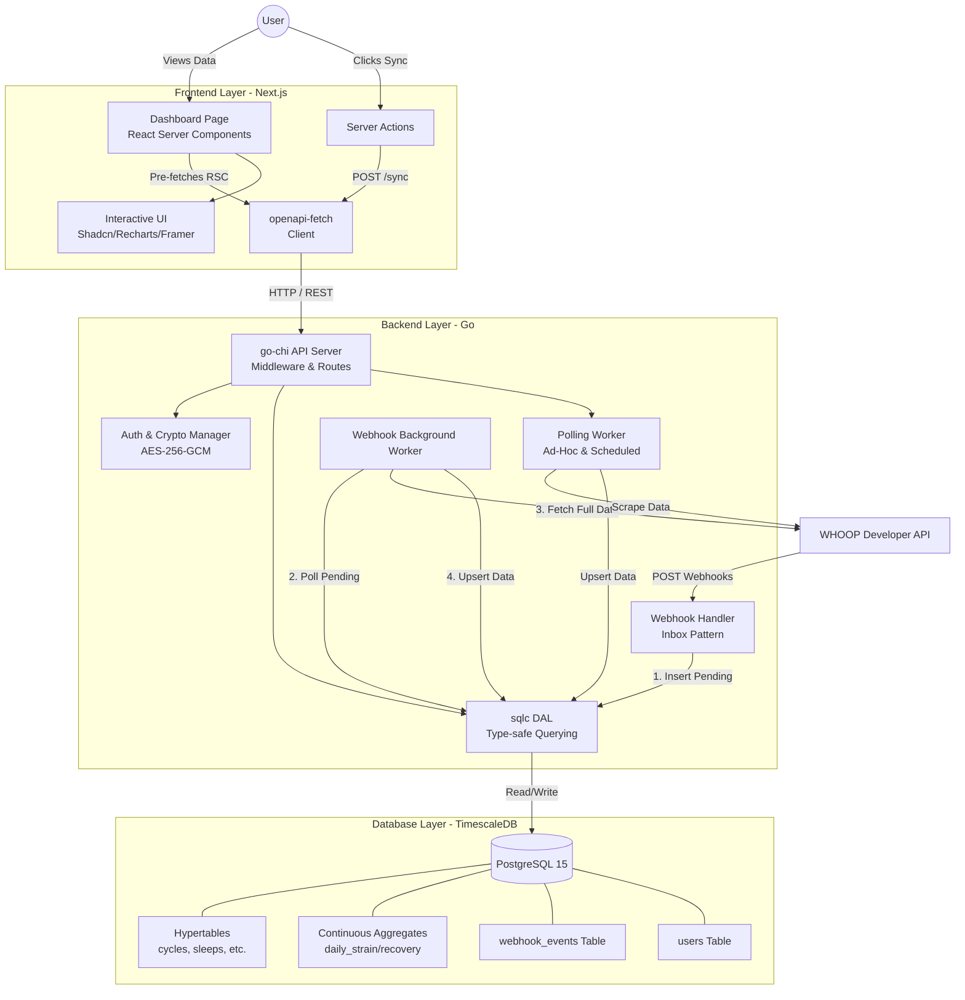

# WHOOP Stats Architecture & Design Document

This document outlines the architectural decisions, component breakdown, and technical justifications for the WHOOP Stats application. The system is designed to be a high-performance, self-hostable, and zero-data-loss platform for ingesting, storing, and visualizing WHOOP fitness data.

The architecture is split into three core layers: **Database (TimescaleDB)**, **Backend (Go)**, and **Frontend (Next.js)**.

---

## 1. Database Layer: Postgres & TimescaleDB

### Components
*   **PostgreSQL 15:** The foundational relational database.
*   **TimescaleDB Extension:** Transforms standard Postgres into a high-performance time-series database.
*   **Hypertables:** Data tables partitioned automatically across time intervals (`cycles`, `sleeps`, `workouts`, `recoveries`).
*   **Continuous Aggregates:** Materialized views (`daily_strain`, `daily_recovery`) that incrementally pre-calculate data.

### Design Decisions & Justifications
*   **Why TimescaleDB?** WHOOP data is inherently time-series (continuous streams of biometric data spanning months or years). Traditional RDBMS struggle with massive time-series scaling. TimescaleDB provides the strict ACID guarantees and relational constraints of Postgres alongside automatic time-partitioning (Hypertables).
*   **Keyset Pagination over OFFSET/LIMIT:** Querying time-series data using `OFFSET x LIMIT y` becomes exponentially slower as the offset grows. We designed the schema with composite indexes (`user_id, start_time DESC`) to enable cursor-based (keyset) pagination, allowing `O(1)` query speed regardless of dataset size.
*   **Idempotency via ON CONFLICT:** We enforce `PRIMARY KEY (id, start_time)`. This ensures that if the backend accidentally pulls or processes the same WHOOP cycle multiple times, the `INSERT ... ON CONFLICT DO UPDATE` query guarantees idempotency. No duplicate data is ever recorded.
*   **Expanded Data Coverage:** Beyond core metrics, the schema tracks detailed sleep stages, recovery markers (SPO2, HRV, Skin Temp), heart rate zone durations for workouts, and athlete-specific data like body measurements and profile information.
*   **Pre-computed Materialized Views:** Rather than dynamically aggregating 30-day strain trends on every dashboard load, we utilize TimescaleDB's Continuous Aggregates. The database automatically buckets and averages strain and recovery in the background. The frontend dashboard queries these views for instantaneous `O(1)` response times.

---

## 2. Backend Layer: Go (Golang)

### Components
*   **HTTP API (go-chi):** A fast, lightweight router handling REST endpoints and middleware (Auth, Rate Limiting, Request IDs).
*   **Webhook Inbox Pattern:** An asynchronous store-and-forward engine for webhook processing.
*   **Polling Engine:** A configurable, concurrent scraping worker for local homelab environments. Now supports full history synchronization via cursor-based pagination.
*   **OAuth2 & Crypto Manager:** Secure token rotation and AES-256-GCM encryption layer.
*   **sqlc DAL:** Type-safe database access layer dynamically generated from SQL queries.

### Design Decisions & Justifications
*   **Why Go?** Go is chosen for its statically compiled nature, extremely low memory footprint, and native concurrency (`goroutines`), making it perfect for running background polling tasks and high-throughput webhooks concurrently on low-resource homelab servers.
*   **Webhook Inbox Pattern vs. Synchronous Webhooks:** WHOOP requires webhook endpoints to respond with a `200 OK` almost immediately. If our server halts to query the WHOOP API for the full object and the API is slow, the webhook connection times out, and data is lost. The "Inbox Pattern" safely dumps the raw payload into a Postgres table instantly. A background worker then processes it at a safe, controlled rate with exponential backoff.
*   **Dual-Mode Ingestion (Poll vs. Webhook):** Not all self-hosters want to open their home networks to the public internet to receive webhooks. The Polling engine was built specifically for homelabs; it makes outbound requests to WHOOP on configurable intervals, cleanly bypassing NAT and firewalls.
*   **Pagination & History Sync:** To ensure no historical gaps, the Polling engine utilizes WHOOP's cursor-based pagination. It recursively follows `next_token` markers for cycles, sleeps, workouts, and recoveries until the entire dataset is synchronized.
*   **SSD Wear Protection & Homelab Longevity:** To protect consumer-grade SSDs in 24/7 environments, the backend implements several I/O optimizations:
    *   **Dynamic Log Levels:** Configurable `LOG_LEVEL` (debug, info, warn, error) allows users to silence non-critical chatter.
    *   **RAM-Backed Ephemeral Storage:** Ephemeral directories (`/tmp`, `/var/log`) are mounted as `tmpfs` (RAM disks) in Docker.
    *   **Local Binary Logging:** Uses Docker's `local` logging driver with compression and rotation to minimize the write amplification of traditional JSON-based text logging.
*   **Application-Level AES-256 Encryption:** OAuth Access and Refresh tokens are highly sensitive. We decrypt and encrypt them in memory on the Go backend using a user-provided 32-byte `ENCRYPTION_KEY`. Tokens rest in the database purely as `BYTEA` ciphertext, ensuring that a database dump does not compromise WHOOP API access.
*   **Concurrency Control (Advisory Locks):** When the frontend user presses "Sync", an ad-hoc sync job fires. To prevent data race conditions, a Mutex/Advisory Lock is engaged for that specific `user_id`. If the user spam-clicks the button, the API safely returns a `409 Conflict` or `429 Too Many Requests`.

---

## 3. Frontend Layer: Next.js & React

### Components
*   **Next.js 16 (App Router):** The core full-stack React framework utilizing Server Components (RSC).
*   **openapi-fetch & openapi-typescript:** Type-safe API client generated dynamically from the Go backend's Swagger specification.
*   **Tailwind CSS v4 & Shadcn UI:** Utility-first styling combined with highly accessible, unstyled component primitives.
*   **Recharts & Framer Motion:** High-end data visualization and fluid layout animations.

### Design Decisions & Justifications
*   **Server-Side Data Fetching (RSC):** The dashboard performs zero client-side fetching for its initial load. Next.js fetches the profile, cycles, sleeps, and insights in parallel directly on the server. This completely eliminates layout shift (CLS) and "loading spinners cascading," delivering the fully populated HTML instantly to the browser.
*   **Dynamic Client Hydration (Map/Charts):** Heavy client-side libraries like `react-simple-maps` (which rely on the browser `window` object) are wrapped in `next/dynamic` with `ssr: false`. This guarantees the server render doesn't fail on window-dependent code, while keeping the main dashboard TTFB (Time to First Byte) blazing fast.
*   **End-to-End Type Safety:** By generating `schema.d.ts` from our Go backend, the frontend API client (`openapi-fetch`) implicitly understands the shape of the database. If a database column changes name in Go, the Next.js build immediately fails, preventing silent runtime regressions.
*   **Linear-Inspired Glassmorphism:** To mirror premium consumer applications, the UI was strictly designed using a deep dark mode (`zinc-950`). We avoided harsh borders, opting for 1px `white/10` borders, backdrop-blurs, and radial glowing gradients. Interactions are tactile (e.g., cards lifting on hover, progress bars animating via Framer Motion), replacing a "raw admin panel" vibe with a polished consumer aesthetic.
*   **Server Actions for Cache Invalidation:** When the manual "Sync" button is pressed, the client calls a Next.js Server Action which pings the Go backend. Upon success, the Server Action invokes `revalidatePath("/")`. This natively purges Next.js's data cache and automatically streams the updated TimescaleDB data straight to the user's screen without a full page refresh.

---

## 4. Full System Architecture Diagram

